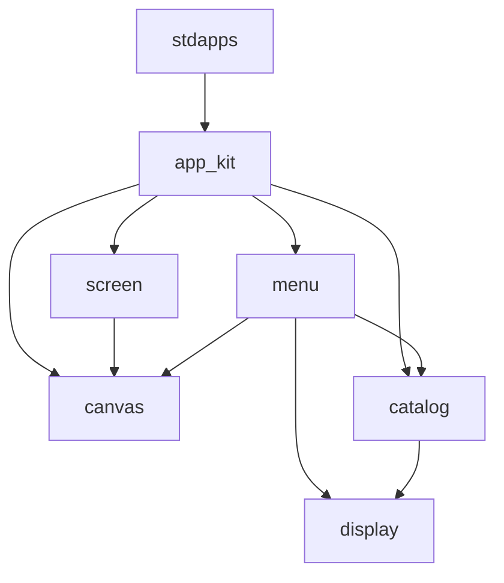

# App Kit reference

Author apps with **`#include "app_kit.h"`**. That header is the umbrella for the
runtime (`APP_DEFINE`, keys, open/exit) and the UI components under
[`apps/ui/components/`](../apps/ui/components/).

Short how-to for adding a builtin: [`docs/apps.md`](apps.md).

## Layout

```
apps/
  app_kit.h / app_kit.c          # runtime: ctx, APP_DEFINE, focus, keys, open/exit
  ui/components/
    display.h                    # APP_DISPLAY_WIDTH / HEIGHT (build-time)
    canvas.h / canvas.c          # dirty + clear / text / flush
    screen.h / screen.c          # dirty-gated titled frame (begin/end)
    menu.h / menu.c              # vertical list + nav bind
    catalog.h / catalog.c        # boot launch list
```



## Lifecycle

1. Install manifests, then once: `app_kit_catalog_build("launcher")`.
2. `app_start("launcher")` (or another home name).
3. Kit runs `on_init` → loop `on_frame` + sleep → `on_cleanup` on exit.
4. Only the **foreground** app receives keys and may flush the display.
5. `app_open(from, name)` starts the child and suspends the caller.
6. `app_request_exit` / `app_bind_back` leaves a non-home app and resumes launcher.

## `APP_DEFINE`

```c
APP_DEFINE(symbol, "install_name",
    .version = "1.0.0",
    .author = "ArdubotOS",
    .description = "...",
    .type = APP_TYPE_USER,   /* or SYSTEM / GAME / TOOL */
    .fps = 30,
    .on_init = on_init,
    .on_frame = on_frame,
    .on_cleanup = on_cleanup   /* optional */
);
```

Exports `symbol_manifest` for `app_install_manifest(...)`.

## Runtime API (`app_kit.h`)

| Call | Purpose |
|------|---------|
| `app_bind_key(app, SIM_KEY_*, fn, user)` | Map a key; `fn(app, user)` on press |
| `app_bind_back(app)` | Escape → `app_request_exit` |
| `app_open(from, "name")` | Launch another app; suspend caller |
| `app_request_exit(app)` | Leave current app |
| `app_kit_is_foreground(app)` | Focus check (canvas uses this) |
| `app_mark_dirty` / `app_is_dirty` | Redraw scheduling (also via canvas) |

## Components

### Display — `display.h`

Compile-time panel size. CMake sets `APP_DISPLAY_WIDTH` / `APP_DISPLAY_HEIGHT`
from `ARDUBOT_DISPLAY_WIDTH` / `ARDUBOT_DISPLAY_HEIGHT` (default **128×64**).

### Canvas — `canvas.h`

| Call | Purpose |
|------|---------|
| `app_mark_dirty` / `app_is_dirty` / `app_clear_dirty` | Dirty flag |
| `app_clear` | Clear framebuffer (foreground only) |
| `app_text` / `app_textf` | Draw text |
| `app_flush` | Present + clear dirty |

### Screen — `screen.h`

Titled frames without hand-rolling dirty/clear/flush:

```c
static void on_frame(app_ctx_t* app) {
    if (!app_screen_begin(app, "Counter")) {
        return;
    }
    app_textf(app, 0, 16, "Count: %d", g_count);
    app_screen_end(app);
}
```

### Menu — `menu.h`

| Call | Purpose |
|------|---------|
| `app_menu_init` / `app_menu_add` / `app_menu_load_catalog` | Build list |
| `app_menu_move(app, menu, delta, user)` | Move; consumes `user`, marks dirty |
| `APP_MENU_ONE_UP` / `APP_MENU_ONE_DOWN` | Deltas |
| `app_menu_bind_nav(app, menu)` | Bind Up/Down for you |
| `app_menu_selected` | Current item |
| `app_menu_draw(app, menu, title, help)` | Full redraw |

### Catalog — `catalog.h`

Built once after installs:

```c
app_kit_catalog_build("launcher");  /* exclude home from the list */
```

| Call | Purpose |
|------|---------|
| `app_kit_catalog_build` / `_clear` / `_count` / `_at` | Snapshot |
| `app_type_tag(type)` | `"[SYS]"` / `"[USR]"` / `"[GME]"` / `"[TOL]"` |
| `app_menu_load_catalog(menu)` | Fill a menu from the snapshot |

## Minimal app sketch

```c
#include "app_kit.h"

static int32_t g_count;

static void on_inc(app_ctx_t* app, void* user) {
    (void)user;
    g_count++;
    app_mark_dirty(app);
}

static void on_init(app_ctx_t* app) {
    app_bind_key(app, SIM_KEY_1, on_inc, NULL);
    app_bind_back(app);
}

static void on_frame(app_ctx_t* app) {
    if (!app_screen_begin(app, "Demo")) {
        return;
    }
    app_textf(app, 0, 16, "%d", g_count);
    app_screen_end(app);
}

APP_DEFINE(demo_app, "demo", .on_init = on_init, .on_frame = on_frame);
```

## Tests

| Binary | Covers |
|--------|--------|
| `test_app_kit` | manifest, bind, back, exit, foreground |
| `test_components_canvas` | dirty / draw safety |
| `test_components_screen` | begin/end |
| `test_components_menu` | move, nav bind, display macros |
| `test_components_catalog` | boot catalog |

## Logging

`APP_INFO`, `APP_WARN`, `APP_ERROR`, `APP_DEBUG` via `app_kit.h` /
`app_framework.h`.
