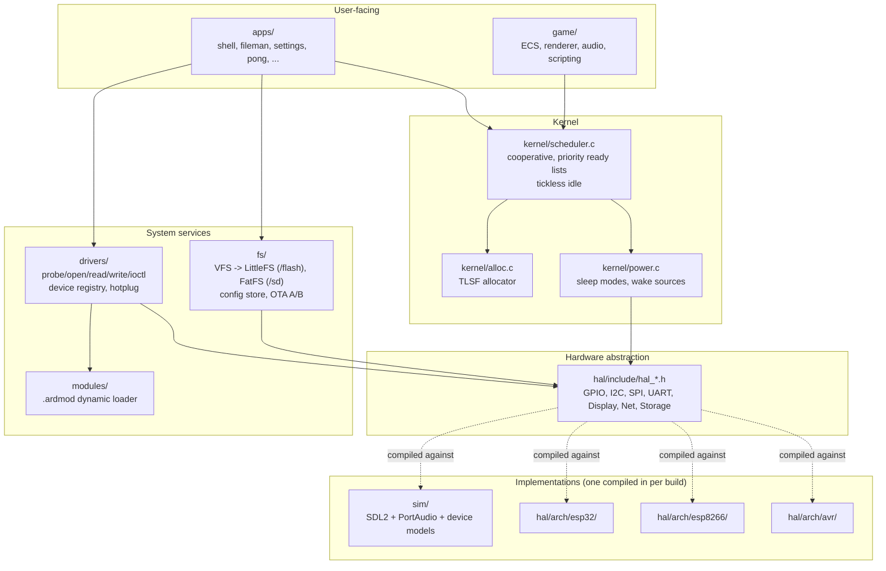
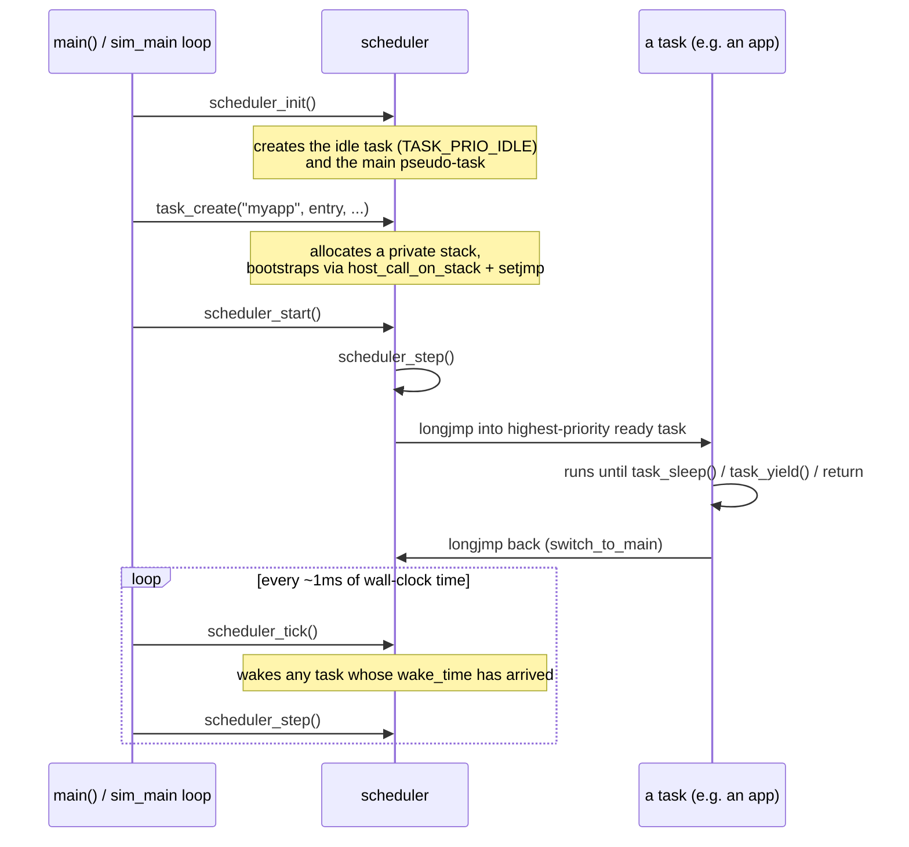
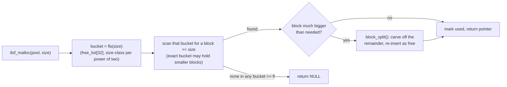

# Architecture

See `PLAN.md` for the full design rationale, locked decisions, and phased roadmap.
See `docs/agent-guide.md` for what is implemented versus still planned, and for
the steps to add an app, a HAL function, or a unit test. This file is a short
map of the codebase for orientation; keep it in sync per rule 10 in `PLAN.md`.

## Layers

```
apps/       user-facing apps (shell, filemgr, settings, ota)
game/       ECS, renderer, audio, scripting, assets
modules/    dynamic .ardmod loader
drivers/    display, sensor, ... (probe/remove/open/read/write/ioctl)
fs/         unified VFS over LittleFS (flash) + FatFS (SD)
hal/        hardware abstraction interfaces (include/) + per-arch impls (arch/)
kernel/     scheduler, time, allocator
```

Portable code (kernel, drivers, fs, game, apps) talks to hardware only through the
`hal_*.h` interfaces in `hal/include/`. Each target — `sim`, `esp32`, `esp8266`, `avr`, `rp2040` —
provides its own implementation under `hal/arch/<target>/` or `sim/`.



Everything above `hal/` is portable C that never includes a backend header
directly - swapping `sim` for `esp32` at build time is the only thing that
changes which arrows on the bottom row are "real".

## Boot and the cooperative scheduler

ArdubotOS uses `setjmp`/`longjmp` host fibers (not OS threads) to give each
task its own stack while staying strictly cooperative - a task only gives up
control at `task_yield()`, `task_sleep()`, or `task_suspend()`, never
preemptively.



Only one task's stack is ever "live" at a time - the sim main loop above
*is* the idle context, which is why `idle_task()` (the dedicated
`TASK_PRIO_IDLE` task created in `scheduler_init()`) never actually runs:
`scheduler_step()` and `task_yield()` both explicitly skip
`TASK_PRIO_IDLE` when picking the next task to switch to.

## Memory: the TLSF allocator

`kernel/alloc.c` implements a small TLSF (Two-Level Segregated Fit) pool
allocator - O(1) malloc/free with low fragmentation, suited to a fixed-size
heap on a microcontroller. `os_malloc`/`os_calloc`/`os_realloc`/`os_free`
wrap a single static 32KB pool (`g_heap_memory`); `tlsf_create`/`tlsf_malloc`/
etc. are the lower-level API usable against any caller-provided buffer
(see `tests/unit/test_kernel_alloc.c` for direct pool tests).



Freeing a block runs `block_merge()` first, coalescing with a physically
adjacent free neighbor (tracked via each block's `prev_phys`/`next_phys`,
independent of the free-list buckets) before reinserting it - this is what
keeps long-running allocate/free churn from fragmenting the pool into
unusable slivers.

## Targets

Selected via CMake options in the top-level `CMakeLists.txt`, resolved in
`cmake/toolchain.cmake`:

| Option | Target | Toolchain |
|---|---|---|
| `ARDUBOT_BUILD_SIM` | Host simulator (SDL2 + PortAudio) | native compiler |
| `ARDUBOT_BUILD_ESP32` | ESP32 | ESP-IDF or bare-metal Xtensa GCC |
| `ARDUBOT_BUILD_ESP8266` | ESP8266 | Xtensa lx106 GCC |
| `ARDUBOT_BUILD_AVR` | Mega2560 | avr-gcc |

The simulator is the primary development target: `sim/` implements the HAL against SDL2
(video/GPIO keys), PortAudio (audio), and per-device register models (`sim_i2c.c`,
`sim_spi.c`, `sim/models/`) so board-level drivers can be developed and tested on a host
machine before hardware is involved.

## Testing

- `tests/unit/` — fast, host-only, no simulator init (Unity framework).
- `tests/integration/` — exercises the simulator end-to-end.
- `tests/hardware/` — QEMU + physical hardware (later phases).

CI (`.github/workflows/sim.yml`) builds and runs `tests/unit` + `tests/integration` via the
simulator's `--headless --test=all` mode on Ubuntu, Windows, and macOS on every push/PR.
